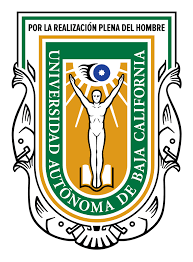

# Universidad Autónoma de Baja California

## Facultad de Ingeniería, Arquitectura y Diseño

---

**Alumno:**  
Leonel Cajeme García

**Grupo:**  
Ing. Software 941

**Materia:**  
Paradigmas de Programación

**Docente:**  
Jose Carlos Gallegos Mariscal

---

## Taller 2 
### Lexico, sintaxis y semantica

---

**Fecha de entrega:** 6 de febrero de 2026

 
 

## Codigo 1 en C

