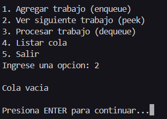
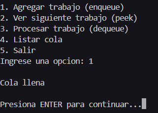
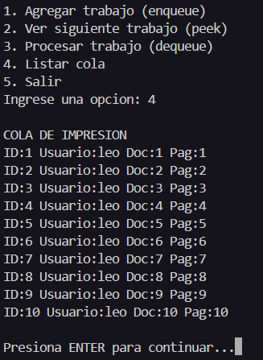
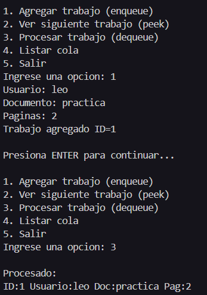
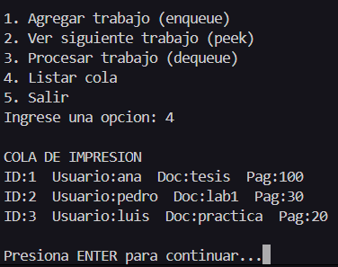
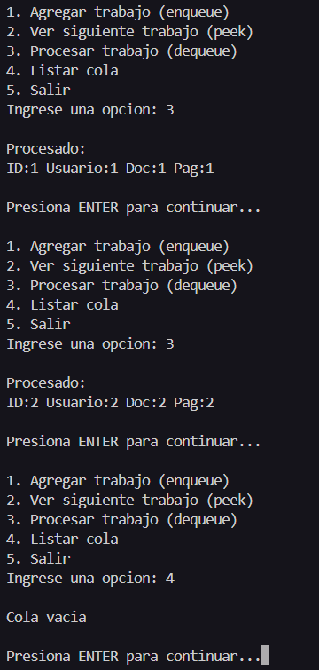
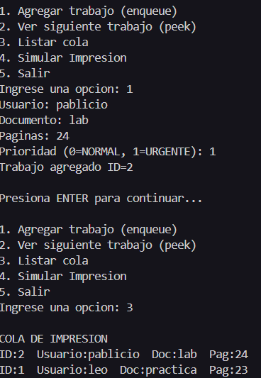
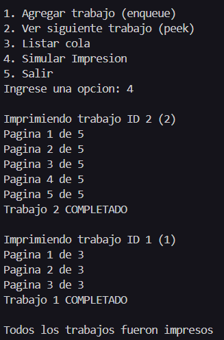
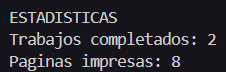

+++
date = '2026-02-20T20:40:34-08:00'
draft = false
title = 'Practica1'
weight = 2
+++

# Práctica 01: Cola de Impresión en Lenguaje C

**Universidad Autónoma de Baja California**  
**Facultad de Ingeniería, Arquitectura y Diseño**  
**Materia:** 40032 – Paradigmas de la Programación  
**Docente:** M.I. José Carlos Gallegos Mariscal  
**Grupo:** 941  
**Nombre:** _Leonel Cajeme Garcia_  
**Matricula:** _379154_  
**Grupo:** _Ing. Software 941_  
**Fecha:** _13 de marzo de 2026_


---

> Repositorio en GitHub: [github.com/leonelcajeme10-eng/Portafolio-Paradigmas](https://github.com/leonelcajeme10-eng/Portafolio-Paradigmas)  
> Página estática (GitHub Pages): [leonelcajeme10-eng.github.io/Portafolio-Paradigmas/](https://leonelcajeme10-eng.github.io/Portafolio-Paradigmas/)


## Índice

1. [Introducción](#1-introducción)
2. [Diseño](#2-diseño)
3. [Implementación](#3-implementación)
4. [Demostración de Conceptos](#4-demostración-de-conceptos)
5. [Simulación](#5-simulación)
6. [Análisis Comparativo](#6-análisis-comparativo)
7. [Conclusiones](#7-conclusiones)
8. [Referencias](#8-referencias)

---

## 1. Introducción

En esta práctica se desarrolló un simulador de cola de impresión en lenguaje C, resolviendo el problema en tres iteraciones progresivas. El problema central consiste en administrar trabajos de impresión (*print jobs*) que llegan en distintos momentos y deben procesarse en orden de llegada (política FIFO: *First In, First Out*).

Una cola es la estructura de datos más adecuada para este problema porque modela fielmente el comportamiento real de una impresora: el primer documento enviado es el primero en imprimirse. Cualquier otra estructura (pila, árbol, etc.) violaría la equidad de atención.

Las tres sesiones abordan el problema con complejidad creciente:

- **Sesión 1:** cola con memoria estática (arreglo fijo de tamaño `MAX_JOBS = 10`).
- **Sesión 2:** migración a memoria dinámica mediante lista enlazada con `malloc`/`free`.
- **Sesión 3:** simulación visible del proceso de impresión, con prioridades, estadísticas y manejo de estado.

---

## 2. Diseño

### 2.1. Estructura `PrintJob_t`

Cada trabajo de impresión se representa con la siguiente estructura:

```c
#define MAX_USER 32
#define MAX_DOC  48

typedef enum { NORMAL = 0, URGENTE = 1 } Prioridad_t;

typedef enum {
    EN_COLA    = 0,
    IMPRIMIENDO = 1,
    COMPLETADO  = 2,
    CANCELADO   = 3,
} Estado_t;

typedef struct {
    int id;                    // identificador autoincremental
    char usuario[MAX_USER];    // nombre del usuario que imprime
    char documento[MAX_DOC];   // nombre del documento
    int paginas_total;         // total de páginas del trabajo
    int paginas_restantes;     // páginas pendientes (para simular progreso)
    int copias;                // número de copias (≥ 1)
    Prioridad_t prioridad;     // NORMAL o URGENTE
    Estado_t estado;           // ciclo de vida del trabajo
    int ms_por_pagina;         // retardo por página en milisegundos
} PrintJob_t;
```

Los campos `paginas_restantes`, `estado` y `ms_por_pagina` son esenciales para la simulación: permiten mostrar el avance página a página y reflejar el ciclo de vida del trabajo en cada etapa.

### 2.2. Cola Estática (`QueueStatic_t`)

La versión estática almacena los trabajos en un arreglo de tamaño fijo:

```
[ job0 | job1 | job2 | ... | jobN-1 | (vacío) ... ]
  ^frente                   ^último elemento válido
  índice 0                  índice size-1
```

- **Frente:** siempre en `data[0]`.
- **Enqueue:** agrega al final en `data[size]` → O(1).
- **Dequeue:** extrae `data[0]` y desplaza todos los demás hacia la izquierda → O(n).
- **Capacidad máxima:** `MAX_JOBS = 10`.

### 2.3. Cola Dinámica (`QueueDynamic_t`)

La versión dinámica usa una lista enlazada simple con punteros `head` (frente) y `tail` (final):

```
head → [job1|next] → [job2|next] → [job3|NULL] ← tail
```

- **Enqueue:** crea un nodo con `malloc` y lo enlaza al `tail` → O(1).
- **Dequeue:** libera el nodo `head` y avanza el puntero → O(1).
- **Capacidad:** ilimitada (acotada solo por la memoria del sistema).

---

## 3. Implementación

### 3.1. Sesión 1 – Cola Estática

| Función | Descripción |
|---|---|
| `qs_init(q)` | Inicializa `size = 0` |
| `qs_is_empty(q)` | Retorna `1` si `size == 0` |
| `qs_is_full(q)` | Retorna `1` si `size == MAX_JOBS` |
| `qs_enqueue(q, job)` | Agrega `job` al final; retorna `0` si llena |
| `qs_peek(q, out)` | Copia `data[0]` a `*out` sin modificar la cola |
| `qs_dequeue(q, out)` | Copia `data[0]` a `*out`, desplaza y decrementa `size` |
| `qs_print(q)` | Imprime todos los trabajos en orden de atención |

**Decisiones de implementación:**

- El frente fijo en `data[0]` simplifica el código al costo de un desplazamiento O(n) en cada `dequeue`. Esto es aceptable para `MAX_JOBS = 10`, pero escalaría mal con colas grandes.
- La entrada numérica se lee con `scanf` con validación del valor de retorno para detectar entradas inválidas.
- Si la entrada de páginas es inválida, se decrementa `id_counter` para no desperdiciar un ID.

### 3.2. Sesión 2 – Cola Dinámica

| Función | Descripción |
|---|---|
| `qd_init(q)` | Inicializa `head = tail = NULL`, `size = 0` |
| `qd_is_empty(q)` | Retorna `1` si `head == NULL` |
| `qd_enqueue(q, job)` | `malloc` de nodo; enlaza al `tail`; valida `NULL` |
| `qd_peek(q, out)` | Copia `head->job` a `*out` sin liberar nada |
| `qd_dequeue(q, out)` | Copia `head->job`, libera el nodo y avanza `head` |
| `qd_destroy(q)` | Recorre toda la lista y libera cada nodo |

**Decisiones relevantes:**

- Se reemplazó `scanf` por `fgets` + `strtol` para mayor robustez ante entradas no numéricas.
- Se agrega `continuar()` después de cada operación para que el usuario pueda leer el resultado antes de que la pantalla se limpie.
- `qd_destroy` se llama explícitamente al salir del menú para garantizar la liberación de toda la memoria reservada.

### 3.3. Sesión 3 – Simulación y Mejoras

Se añadieron las siguientes funciones a la versión dinámica:

| Función | Descripción |
|---|---|
| `simular_impresion(q)` | Procesa toda la cola página a página con `delay_ms` |
| `qd_enqueue_urgente(q, job)` | Inserta al **frente** en vez de al final |
| `delay_ms(ms)` | Abstracción multiplataforma (`Sleep` / `usleep`) |

**Mejoras implementadas:**

1. **Prioridad URGENTE:** al encolar un trabajo con `prioridad = URGENTE`, se llama a `qd_enqueue_urgente`, que inserta el nodo al frente de la lista. Así siempre se atiende antes que los trabajos `NORMAL`.

2. **Estadísticas:** las variables globales `trabajos_completados` y `paginas_impresas` acumulan datos durante la simulación y se muestran al finalizar.

---

## 4. Demostración de Conceptos

### 4.1. Alcance y Duración de Variables

**Variable local – `job` dentro de `menu()`:**

```c
void menu() {
    PrintJob_t job;   // variable local, vive en el stack del marco de menu()
    // ...
}
```

`job` se declara local porque es temporal: solo se necesita para capturar los datos del usuario antes de encolarlos. Una vez que `qs_enqueue` o `qd_enqueue` copia la estructura, `job` puede reutilizarse sin riesgo.

**Variable global – `trabajos_completados` y `paginas_impresas` (Sesión 3):**

```c
int trabajos_completados = 0;
int paginas_impresas = 0;
```

Se declaran globales porque acumulan estado a lo largo de toda la ejecución del programa y son compartidas entre `menu()` y `simular_impresion()`. Una alternativa más limpia sería un struct de estadísticas pasado por puntero, pero para el alcance de la práctica la variable global es suficiente y su propósito es claro.

**Variable local de ciclo – `id_counter` dentro de `menu()`:**

```c
int id_counter = 1;
```

Es local a `menu()` porque el contador de IDs solo tiene sentido mientras el menú esté activo. No se necesita en ninguna otra función.

### 4.2. Memoria – Stack vs. Heap

**Versión estática (Sesión 1):**

```c
typedef struct {
    PrintJob_t data[MAX_JOBS];  // arreglo en stack (o data segment si es global)
    int size;
} QueueStatic_t;
```

La estructura `QueueStatic_t` vive completamente en el stack de `menu()`. No se reserva ni libera memoria dinámica; el sistema la recupera al salir del marco de función.

**Versión dinámica (Sesión 2) – reserva con `malloc`:**

```c
int qd_enqueue(QueueDynamic_t *q, PrintJob_t job) {
    Node_t *newNode = (Node_t *)malloc(sizeof(Node_t));  // reserva en el heap
    if (newNode == NULL) {
        printf("Error: no hay memoria disponible\n");
        return 0;
    }
    newNode->job = job;
    newNode->next = NULL;
    // ...
}
```

Cada nodo vive en el heap. Si `malloc` regresa `NULL` (memoria insuficiente), la función informa el error y retorna `0` sin corromper la cola.

**Liberación con `free` y `qd_destroy`:**

```c
void qd_destroy(QueueDynamic_t *q) {
    Node_t *current = q->head;
    while (current != NULL) {
        Node_t *temp = current;
        current = current->next;
        free(temp);             // libera cada nodo del heap
    }
    q->head = NULL;
    q->tail = NULL;
    q->size = 0;
}
```

`qd_destroy` recorre la lista completa y libera cada nodo. Se guarda `current->next` antes de llamar `free` porque una vez liberado el nodo, acceder a `temp->next` sería comportamiento indefinido. Si se omitiera esta función, todos los nodos que quedan en la cola al salir del programa causarían una fuga de memoria detectada, por ejemplo, con `valgrind`.

### 4.3. Contratos de Funciones – Modificación vs. Consulta

**Función que solo consulta (usa `const`):**

```c
int qd_peek(const QueueDynamic_t *q, PrintJob_t *out) {
    if (qd_is_empty(q)) return 0;
    *out = q->head->job;   // copia el trabajo, no mueve el nodo
    return 1;
}
```

El parámetro `const QueueDynamic_t *q` le comunica al compilador —y al programador— que esta función **nunca** modifica la cola. `peek` solo inspecciona el frente y copia su contenido a `*out`.

**Función que modifica la cola (puntero sin `const`):**

```c
int qd_dequeue(QueueDynamic_t *q, PrintJob_t *out) {
    if (qd_is_empty(q)) return 0;
    Node_t *temp = q->head;
    *out = temp->job;
    q->head = q->head->next;   // modifica la estructura interna
    if (q->head == NULL) q->tail = NULL;
    free(temp);
    q->size--;
    return 1;
}
```

Aquí `q` no es `const` porque la función cambia `head`, `tail` y `size`. Retorna `0` si la cola está vacía, protegiendo al llamador de un comportamiento indefinido.

### 4.4. Tipos de Datos – `struct` y `enum`

**Uso de `enum`:** `Prioridad_t` y `Estado_t` convierten valores enteros en nombres significativos. Comparar `job.estado == IMPRIMIENDO` es mucho más legible que `job.estado == 1` y elimina el riesgo de usar un entero fuera de rango. El compilador también advierte si un `switch` no cubre todos los casos del enum.

**Uso de `struct`:** `PrintJob_t` agrupa en una sola unidad todos los atributos de un trabajo. Esto permite pasar y copiar un trabajo completo con una sola asignación (`q->data[q->size] = job`) en lugar de copiar campo por campo, y hace que las firmas de las funciones sean compactas y expresivas.

---

## 5. Simulación

### 5.1. Lógica de Progreso por Páginas

La función `simular_impresion` procesa la cola completa de la siguiente manera:

```c
void simular_impresion(QueueDynamic_t *q) {
    PrintJob_t job;
    while (!qd_is_empty(q)) {
        qd_dequeue(q, &job);
        job.estado = IMPRIMIENDO;
        printf("\nImprimiendo trabajo ID %d (%s)\n", job.id, job.documento);

        while (job.paginas_restantes > 0) {
            printf("Pagina %d de %d\n",
                   job.paginas_total - job.paginas_restantes + 1,
                   job.paginas_total);
            delay_ms(job.ms_por_pagina);   // pausa visible por página
            job.paginas_restantes--;
        }

        job.estado = COMPLETADO;
        printf("Trabajo %d COMPLETADO\n", job.id);
        trabajos_completados++;
        paginas_impresas += job.paginas_total;
    }
    // ... imprime estadísticas finales
}
```

El campo `paginas_restantes` se inicializa igual a `paginas_total` al encolar el trabajo. El bucle interno lo decrementa uno a uno, mostrando en cada iteración el número de página actual. El retardo `delay_ms(ms_por_pagina)` hace la simulación visible en tiempo real.

### 5.2. Implementación del Delay

```c
void delay_ms(int ms) {
#ifdef _WIN32
    Sleep(ms);       // Windows: Sleep recibe milisegundos
#else
    usleep(ms * 1000); // POSIX: usleep recibe microsegundos
#endif
}
```

La directiva `#ifdef` hace que el código sea portable: compila correctamente en Windows y en sistemas POSIX (Linux/macOS) sin cambios.

### 5.3. Ciclo de Vida del Estado

```
EN_COLA  →  IMPRIMIENDO  →  COMPLETADO
```

Un trabajo inicia en `EN_COLA` al ser encolado. Pasa a `IMPRIMIENDO` en el momento en que `simular_impresion` lo toma del frente. Al terminar todas sus páginas, su estado cambia a `COMPLETADO`. El estado `CANCELADO` está definido en el enum para una posible mejora futura de cancelación por ID.

### 5.4. Evidencia de Ejecución

---

#### Sesión 1 – Cola estática

**Captura 1A – Peek y dequeue con cola vacía**



---

**Captura 1B – Cola llena**




---

**Captura 1C – Dequeue confirma FIFO**



---

#### Sesión 2 – Cola dinámica

**Captura 2A – Enqueue y listado en orden FIFO**



---

**Captura 2B – Dequeue hasta vaciar la cola**



---

#### Sesión 3 – Simulación completa

**Captura 3A – Prioridad URGENTE al frente**



---

**Captura 3B – Simulación en progreso (página a página)**



---

**Captura 3C – Estadísticas finales**



---

## 6. Análisis Comparativo

### 6.1. Diferencias entre Cola Estática y Dinámica

| Aspecto | Cola Estática | Cola Dinámica |
|---|---|---|
| **Capacidad** | Fija (`MAX_JOBS = 10`) | Ilimitada (memoria del sistema) |
| **Complejidad `enqueue`** | O(1) | O(1) |
| **Complejidad `dequeue`** | O(n) por el desplazamiento | O(1) |
| **Memoria** | Reservada en compilación | Reservada y liberada en ejecución |
| **Riesgo de desbordamiento** | Sí, si `size == MAX_JOBS` | No (salvo agotamiento de RAM) |
| **Riesgo de fuga de memoria** | No aplica | Sí, si se omite `qd_destroy` |
| **Complejidad del código** | Menor | Mayor (manejo de punteros y `NULL`) |

El principal costo de la versión estática es el `dequeue` O(n): al eliminar el primer elemento hay que desplazar todos los demás. Para `MAX_JOBS = 10` el costo es insignificante, pero con miles de trabajos sería inaceptable. Una cola circular resolvería esto manteniendo la memoria estática y logrando O(1) en ambas operaciones.

La versión dinámica elimina ese problema y no tiene límite de capacidad, pero introduce la responsabilidad explícita de liberar memoria. Un `qd_destroy` olvidado produce fugas que en un proceso de larga duración (servidor de impresión real) acumularían gigabytes de memoria inaccesible.

### 6.2. Impacto en Alcance y Duración de Variables

- El **contador `id_counter`** es local a `menu()` en ambas versiones. Su duración coincide con la sesión interactiva del programa; no tiene sentido fuera de ella.
- Los **nodos** de la lista dinámica tienen duración en heap: se crean en `qd_enqueue` y se destruyen en `qd_dequeue` o `qd_destroy`. Desacoplan el tiempo de vida del dato de la estructura que lo contiene.
- Las **variables globales** de estadísticas (`trabajos_completados`, `paginas_impresas`) tienen duración estática: existen desde el inicio hasta el fin del proceso. Son adecuadas para acumuladores de sesión, aunque un diseño más limpio usaría un struct pasado por puntero.

### 6.3. Complejidad Temporal y Costo de Memoria

| Operación | Estática | Dinámica |
|---|---|---|
| `enqueue` | O(1) | O(1) |
| `peek` | O(1) | O(1) |
| `dequeue` | O(n) | O(1) |
| `destroy` | O(1) (sale del marco) | O(n) (recorre y libera) |
| **Memoria fija** | `sizeof(PrintJob_t) × MAX_JOBS` | 0 bytes base |
| **Memoria por trabajo** | Ya reservada | `sizeof(Node_t)` al encolar |

La memoria de la versión estática siempre reserva espacio para `MAX_JOBS` trabajos aunque la cola esté vacía. La dinámica reserva exactamente lo que usa, pero cada nodo lleva el overhead de un puntero adicional (`next`).

### 6.4. Principales Errores Encontrados y Mitigaciones

| Error | Causa | Mitigación |
|---|---|---|
| `scanf` rompía con `\n` rezagado | Buffer de stdin sin vaciar | Se reemplazó por `fgets` + `strtol` |
| `id_counter` se incrementaba antes de validar | Asignación `job.id = id_counter++` al inicio del `case` | Se decrementa `id_counter--` si la entrada es inválida |
| `tail` quedaba apuntando a nodo liberado | `dequeue` no actualizaba `tail` cuando la cola quedaba vacía | Se agrega `if (q->head == NULL) q->tail = NULL` |
| Acceso a `temp->next` tras `free` | Orden incorrecto en `qd_destroy` | Se guarda `current = current->next` antes de `free(temp)` |

---

## 7. Conclusiones

Esta práctica permitió comprender de manera progresiva el diseño de estructuras de datos en C y las implicaciones de cada decisión de diseño:

- Una cola **estática** es simple de implementar y libre de fugas, pero impone un límite fijo de capacidad y un `dequeue` costoso por el desplazamiento.
- Una cola **dinámica** elimina ambas limitaciones, pero transfiere al programador la responsabilidad de liberar cada nodo. La omisión de `qd_destroy` es uno de los errores más comunes y difíciles de detectar sin herramientas como `valgrind`.
- El uso de **`const`** en los parámetros de funciones que solo consultan no es solo un detalle de estilo: permite al compilador advertir si accidentalmente se intenta modificar la cola desde una función de consulta, y comunica el contrato de la función a quien la usa.
- La separación entre **estados** (`EN_COLA`, `IMPRIMIENDO`, `COMPLETADO`) hace que la simulación sea extensible: agregar cancelación, pausa o reintentos solo requiere añadir un estado y manejar las transiciones, sin cambiar la lógica de la cola.

Como mejoras futuras se considerarían: usar una cola circular para la versión estática (O(1) en `dequeue`), implementar cancelación por ID con búsqueda lineal O(n), y separar las estadísticas en un struct propio en lugar de variables globales.

---

## 8. Referencias

- Kernighan, B. W., & Ritchie, D. M. (1988). *The C Programming Language* (2nd ed.). Prentice Hall.
- Sedgewick, R., & Wayne, K. (2011). *Algorithms* (4th ed.). Addison-Wesley. Capítulo 1.3: Bags, Queues, and Stacks.
- ISO/IEC 9899:2011. *Programming languages – C* (C11 Standard). International Organization for Standardization.
- cppreference.com. (s.f.). *C memory management*. Recuperado de https://en.cppreference.com/w/c/memory
- GNU Project. (s.f.). *Valgrind User Manual*. Recuperado de https://valgrind.org/docs/manual/manual.html