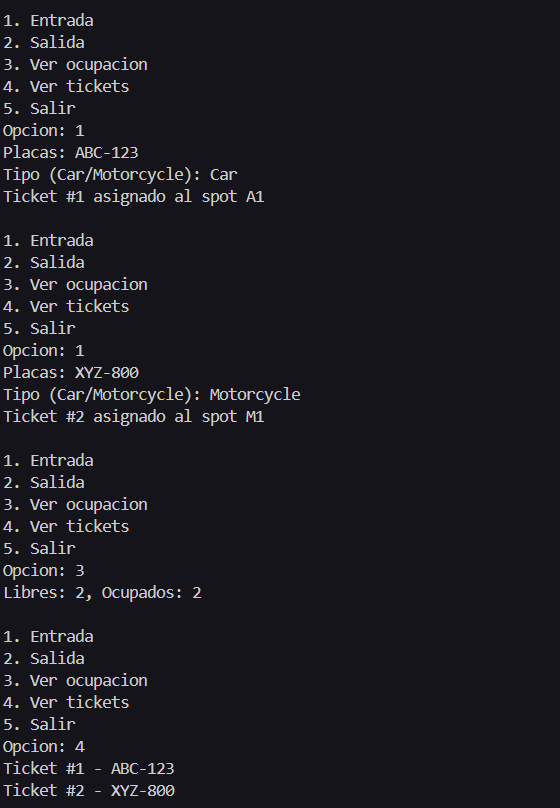
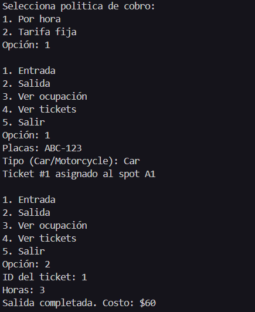
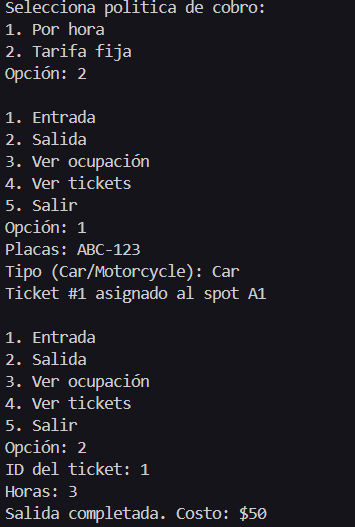
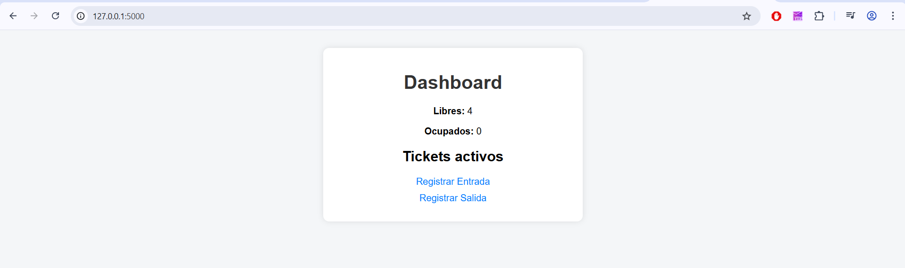
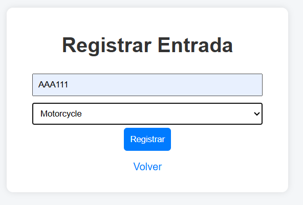
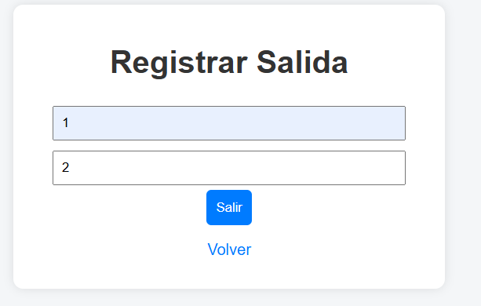

+++
date = '2026-02-20T20:40:39-08:00'
draft = false
title = 'Practica2'
weight = 3
+++

# Práctica 02: Simulador de Estacionamiento

**Universidad Autónoma de Baja California**  
**Facultad de Ingeniería, Arquitectura y Diseño**  
**Materia:** 40032 – Paradigmas de la Programación  
**Docente:** M.I. José Carlos Gallegos Mariscal  
**Grupo:** 941  
**Nombre:** _Leonel Cajeme Garcia_  
**Matricula:** _379154_  
**Grupo:** _Ing. Software 941_  
**Fecha:** _2 de abril de 2026_

---

> Repositorio en GitHub: [github.com/leonelcajeme10-eng/Portafolio-Paradigmas](https://github.com/leonelcajeme10-eng/Portafolio-Paradigmas)  
> Página estática (GitHub Pages): [leonelcajeme10-eng.github.io/Portafolio-Paradigmas/](https://leonelcajeme10-eng.github.io/Portafolio-Paradigmas/)

---

## 1. Introducción

Se desarrolló un Simulador de Estacionamiento en Python aplicando POO. El sistema administra lugares (*spots*), vehículos y tickets: registra entradas y salidas, calcula cobros según una política de tarifas intercambiable y expone una interfaz de consola (sesiones 1–2) y una interfaz web con Flask bajo patrón MVC (sesión 3).

---

## 2. Conceptos POO aplicados

### Clase y Objeto
Una **clase** es la plantilla que define atributos y métodos; un **objeto** es su instancia concreta en memoria. En el proyecto, `Car("ABC-123")` es un objeto de la clase `Car`.

### Encapsulamiento
Los atributos internos se declaran privados (`__`) y solo se modifican a través de métodos que validan invariantes.

```python
class ParkingSpot:
    def __init__(self, spot_id, allowed):
        self.__spot_id = spot_id
        self.__occupied = False

    def park(self, vehicle):
        if self.__occupied:
            raise ValueError("Lugar ya ocupado.")
        self.__occupied = True

    def release(self):
        self.__occupied = False
```
*Invariante garantizada: nunca dos vehículos en el mismo lugar.*

### Abstracción
`RatePolicy` define la interfaz de cobro; el resto del sistema no necesita conocer la implementación concreta.

```python
from typing import Protocol

class RatePolicy(Protocol):
    def calculate(self, hours: float, vehicle) -> float: ...

class HourlyRatePolicy:
    def __init__(self, car_rate=20.0, moto_rate=10.0):
        self.__car_rate = car_rate
        self.__moto_rate = moto_rate

    def calculate(self, hours, vehicle):
        rate = self.__car_rate if vehicle.get_type() == VehicleType.CAR \
               else self.__moto_rate
        return round(hours * rate, 2)
```

### Herencia y subtipos
`Car` y `Motorcycle` heredan de `Vehicle`, reutilizando atributos y métodos comunes.

```python
class Vehicle:
    def __init__(self, plate, vtype):
        self.__plate = plate
        self.__type  = vtype
    def get_plate(self): return self.__plate
    def get_type(self):  return self.__type

class Car(Vehicle):
    def __init__(self, plate):
        super().__init__(plate, VehicleType.CAR)

class Motorcycle(Vehicle):
    def __init__(self, plate):
        super().__init__(plate, VehicleType.MOTORCYCLE)
```

### Polimorfismo
La misma llamada `policy.calculate()` produce resultados distintos según la política inyectada, sin cambiar `ParkingLot`.

```python
auto = Car("ABC-123")
moto = Motorcycle("XYZ-777")
hourly = HourlyRatePolicy()
flat   = FlatRatePolicy(50.0)

# Mismo método, resultados distintos:
print(hourly.calculate(2, auto))  # 40.0
print(hourly.calculate(2, moto))  # 20.0
print(flat.calculate(2, auto))    # 50.0
```

---

## 3. Modelo del dominio

| Clase | Responsabilidad principal |
|---|---|
| `Vehicle` / `Car` / `Motorcycle` | Representar vehículos con placa y tipo |
| `ParkingSpot` | Gestionar ocupación de un lugar físico |
| `Ticket` | Registrar estancia (vehículo, spot, tiempos, estado) |
| `ParkingLot` | Orquestar spots, tickets y política de cobro |
| `HourlyRatePolicy` | Tarifa por hora diferenciada por tipo de vehículo |
| `FlatRatePolicy` | Tarifa plana fija |

---

## 4. MVC con Flask

| Capa | Ubicación | Contenido |
|---|---|---|
| **Model** | `models/` | `ParkingLot`, `Ticket`, `Vehicle`, políticas |
| **View** | `templates/` | `dashboard.html`, `entry.html`, `exit.html` |
| **Controller** | `app.py` | Rutas Flask que llaman al modelo y renderizan vistas |

Las rutas Flask delegan **toda** la lógica al modelo; nunca contienen reglas de negocio.

```
GET  /       → dashboard: ocupación + tickets activos
GET  /entry  → formulario de entrada
POST /entry  → lot.enter(vehicle, now)
GET  /exit   → formulario de salida
POST /exit   → lot.exit(ticket_id, now)
```

---

## 5. Evidencia de ejecución

> **Cómo obtener las capturas:**

**CLI – flujo completo** (`python cli.py`): registra dos entradas (ABC-123 tipo Car, XYZ-777 tipo Motorcycle), consulta ocupación, registra salida del ticket 1 con 2 horas y consulta tickets activos.



**Polimorfismo** – ejecuta el mismo flujo dos veces: una con `HourlyRatePolicy` y otra con `FlatRatePolicy`. Muestra que el costo varía.




**Web Flask** (`python app.py`): captura del dashboard, del formulario de entrada y del resultado de salida.





---

## 6. Conclusiones

POO demostró ventajas concretas en este proyecto. El **encapsulamiento** garantiza invariantes sin depender de disciplina externa. La **abstracción** con `RatePolicy` permitió cambiar la política de cobro sin tocar ninguna otra clase. La **herencia** evitó duplicar código entre `Car` y `Motorcycle`. El **polimorfismo** hace que agregar una nueva política de tarifa no requiera modificar `ParkingLot`, cumpliendo el principio Abierto/Cerrado. Finalmente, el patrón **MVC** separó responsabilidades de forma que el mismo modelo funcionó tanto en CLI como en web sin reescribir lógica.

---

## Referencias

- Pallets Projects. (2026). *Flask Documentation 3.1.x*. https://flask.palletsprojects.com/
- Python Software Foundation. (2026). *dataclasses*. https://docs.python.org/3/library/dataclasses.html
- Fowler, M. (2004). *Inversion of Control and Dependency Injection*. https://martinfowler.com/articles/injection.html
- Python Typing Team. (2026). *Protocols – typing specification*. https://typing.python.org/en/latest/spec/protocol.html
