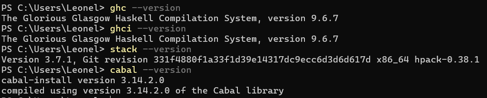
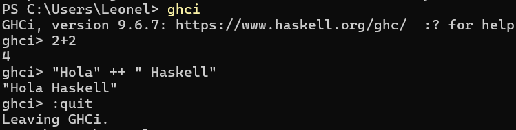
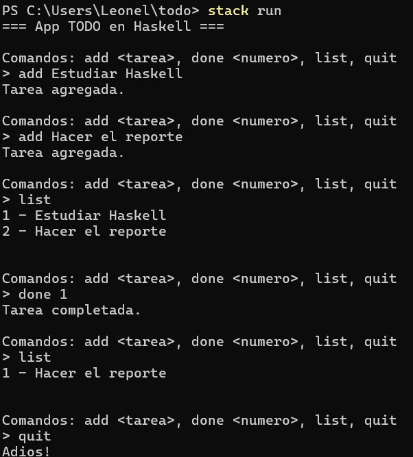

+++
date = '2026-02-20T20:40:39-08:00'
draft = false
title = 'Practica3'
weight = 4
+++

# Práctica 03: Entorno de Desarrollo Haskell y App TODO

**Universidad Autónoma de Baja California**  
**Facultad de Ingeniería, Arquitectura y Diseño**  
**Materia:** 40032 – Paradigmas de la Programación  
**Docente:** M.I. José Carlos Gallegos Mariscal  
**Grupo:** 941  
**Nombre:** _Leonel Cajeme Garcia_  
**Matricula:** _379154_  
**Grupo:** _Ing. Software 941_  
**Fecha:** _1 de mayo de 2026_

---

> Repositorio en GitHub: [github.com/leonelcajeme10-eng/Portafolio-Paradigmas](https://github.com/leonelcajeme10-eng/Portafolio-Paradigmas)  
> Página estática (GitHub Pages): [leonelcajeme10-eng.github.io/Portafolio-Paradigmas/](https://leonelcajeme10-eng.github.io/Portafolio-Paradigmas/)

---

## Introducción

Haskell es un lenguaje de programación puramente funcional con evaluación perezosa (lazy evaluation) y un sistema de tipos estático fuerte. A diferencia de los lenguajes imperativos como C o Python, en Haskell los programas se construyen mediante la composición de funciones matemáticas, sin efectos secundarios ni estado mutable. Esta práctica tiene como objetivo instalar el entorno de desarrollo de Haskell y construir una aplicación de lista de tareas (TODO) en la línea de comandos utilizando Stack como manejador de proyectos.

---

## Sesión 1: Instalación del Entorno de Desarrollo

### Herramientas instaladas

La instalación se realizó mediante **GHCup**, la herramienta oficial para gestionar el entorno de desarrollo de Haskell en Windows. El comando de instalación se ejecutó en PowerShell (sin modo administrador) desde la página oficial [haskell.org/downloads](https://www.haskell.org/downloads).

Las herramientas que se instalaron son:

| Herramienta | Descripción |
|-------------|-------------|
| **GHCup** | Gestor del entorno de desarrollo. Descarga e instala todas las demás herramientas. |
| **GHC** | Glasgow Haskell Compiler. Compilador principal de Haskell. |
| **GHCi** | Intérprete interactivo de Haskell, permite ejecutar código directamente en consola. |
| **HLS** | Haskell Language Server. Contiene las librerías estándar y soporte de lenguaje. |
| **Stack** | Manejador de paquetes y proyectos, similar a `pip` en Python. |
| **Cabal** | Herramienta de empaquetado (buildtool) que utiliza Stack para dependencias y GHC para compilar. |

Los archivos de código fuente de Haskell usan la extensión `.hs`.

### Proceso de instalación


<!-- IMAGEN 1: Captura de pantalla del instalador de GHCup corriendo en PowerShell -->
<!-- Descripción: Ventana de PowerShell mostrando el proceso de descarga e instalación de GHCup con las barras de progreso -->

Durante la instalación, el sistema preguntó si se deseaban crear accesos directos en el escritorio (shortcuts) para la desinstalación y para abrir la terminal MSYS2. Se aceptó esta opción. MSYS2 es un entorno que simula comandos Unix/Linux dentro de Windows, necesario para que GHCup funcione correctamente.

### Verificación de la instalación

Una vez concluida la instalación, se verificó que todas las herramientas quedaron disponibles ejecutando los siguientes comandos en PowerShell:

```powershell
ghc --version
ghci --version
stack --version
cabal --version
```



---

## Sesión 2: Aplicación TODO en Haskell

### Creación del proyecto con Stack

Para crear el proyecto se utilizó el comando `stack new`, que genera la estructura de directorios y archivos de configuración necesarios:

```powershell
stack new todo
cd todo
```

Stack crea automáticamente la siguiente estructura de proyecto:

```
todo/
├── app/
│   └── Main.hs        ← Código principal de la aplicación
├── src/
│   └── Lib.hs         ← Módulo de librería
├── test/
│   └── Spec.hs        ← Pruebas
├── stack.yaml          ← Configuración de Stack
└── todo.cabal          ← Configuración de Cabal
```

### Código fuente: `app/Main.hs`

El código de la aplicación se escribió en el archivo `app/Main.hs`. A continuación se muestra y explica cada sección:

```haskell
module Main where

import System.IO

type Items = [String]
```

Se define el módulo principal y se importa `System.IO` para manejar la salida en tiempo real. `Items` es un alias de tipo para una lista de cadenas de texto.

```haskell
addItem :: String -> Items -> Items
addItem item items = items ++ [item]

removeItem :: Int -> Items -> Items
removeItem n items = take (n-1) items ++ drop n items
```

`addItem` toma un texto y una lista, y devuelve una nueva lista con el elemento agregado al final. `removeItem` toma un índice y devuelve la lista sin ese elemento, utilizando las funciones `take` y `drop`. Estas funciones son **puras**: no modifican la lista original, sino que crean una nueva lista. Esto es propio del paradigma funcional.

```haskell
displayItems :: Items -> String
displayItems items =
  let numberedItems = zipWith (\n item -> show n ++ " - " ++ item) [1..] items
  in unlines numberedItems
```

`displayItems` convierte la lista de tareas en un texto numerado. Usa `zipWith` para combinar cada tarea con su número correspondiente usando una función lambda (`\n item -> ...`).

```haskell
interactWithUser :: Items -> IO ()
interactWithUser items = do
  putStrLn "\nComandos: add <tarea>, done <numero>, list, quit"
  putStr "> "
  hFlush stdout
  line <- getLine
  case words line of
    ["quit"] -> putStrLn "Adios!"
    ["list"] -> do
      putStrLn (displayItems items)
      interactWithUser items
    ("add":rest) -> do
      let newItems = addItem (unwords rest) items
      putStrLn "Tarea agregada."
      interactWithUser newItems
    ["done", n] -> do
      let newItems = removeItem (read n) items
      putStrLn "Tarea completada."
      interactWithUser newItems
    _ -> do
      putStrLn "Comando no reconocido."
      interactWithUser items
```

Esta función maneja la interacción con el usuario. Utiliza **recursión** en lugar de un ciclo `while` (que no existe en Haskell): cada vez que el usuario ingresa un comando, la función se llama a sí misma con la lista actualizada. El `case` analiza el comando ingresado y ejecuta la acción correspondiente.

```haskell
main :: IO ()
main = do
  putStrLn "=== App TODO en Haskell ==="
  interactWithUser []
```

El punto de entrada del programa. Inicia la aplicación con una lista vacía `[]`.

### Compilación y ejecución

La aplicación se compiló y ejecutó con:

```powershell
stack build
stack run
```

### Funcionamiento de la aplicación

La aplicación permite al usuario gestionar una lista de tareas desde la línea de comandos. Los comandos disponibles son:

| Comando | Descripción |
|---------|-------------|
| `add <tarea>` | Agrega una nueva tarea a la lista |
| `list` | Muestra todas las tareas numeradas |
| `done <número>` | Elimina la tarea con ese número (marca como completada) |
| `quit` | Cierra la aplicación |

A continuación se muestra la ejecución de la aplicación probando todos los comandos:



---

## Conceptos del Paradigma Funcional observados

Durante el desarrollo de esta práctica se pudieron observar los siguientes conceptos clave del paradigma funcional aplicados en Haskell:

**Inmutabilidad:** Las funciones `addItem` y `removeItem` no modifican la lista original; generan una lista nueva. No existe estado mutable.

**Recursión en lugar de ciclos:** La función `interactWithUser` se llama a sí misma para repetir el ciclo de interacción, ya que Haskell no tiene ciclos `while` o `for` tradicionales.

**Funciones puras:** La mayoría de las funciones (`addItem`, `removeItem`, `displayItems`) son puras: dado el mismo input, siempre producen el mismo output y no tienen efectos secundarios.

**Funciones de orden superior:** `zipWith` es una función de orden superior que recibe otra función como argumento para combinar dos listas elemento a elemento.

**Pattern matching:** El `case` en `interactWithUser` utiliza coincidencia de patrones para analizar el comando del usuario, una característica central de Haskell.

**Sistema de tipos:** El compilador verifica los tipos en tiempo de compilación. Por ejemplo, `addItem :: String -> Items -> Items` declara explícitamente los tipos de entrada y salida.

---

## Conclusión

Esta práctica permitió instalar y configurar un entorno de desarrollo completo para Haskell utilizando GHCup y Stack. Se construyó una aplicación de lista de tareas funcional en la línea de comandos que demuestra los principios fundamentales de la programación funcional: inmutabilidad, recursión, funciones puras y pattern matching. Aunque Haskell tiene una curva de aprendizaje pronunciada para quienes vienen del paradigma imperativo, su sistema de tipos y su enfoque funcional ofrecen una forma diferente y rigurosa de pensar los problemas computacionales.